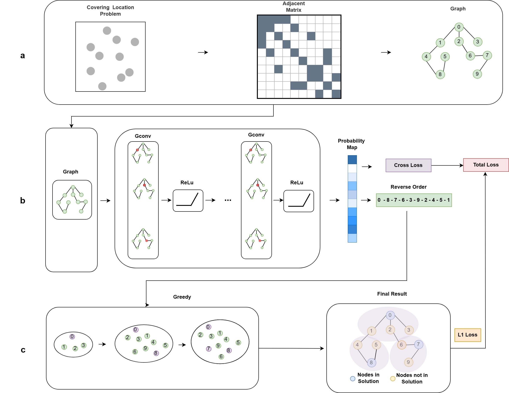

# GCN-Greedy: A Hybrid Framework  using Graph Convolutional Network and Greedy algorithm for Covering Location Problem
This repository contains code for the study "GCN-Greedy: A Hybrid Framework  using Graph Convolutional Network and Greedy algorithm for Covering Location Problem"
We use GCN network to solve location set covering problem (LSCP) and maximum covering location problem (MCLP) problems.The optimization of the loss function takes into account the characteristics of covering location problems.
Our model is more accurate and more efficient than classical heuristic algorithms.





## Usage
We ran our code using Python 3.8.0, PyTorch 1.12.1 and CUDA 11.7.
### Dependencies
Install all dependencies using pip.
```shell
pip install -f requirements.txt
```
### Quick start
Download and unzip [`data.zip`](https://drive.google.com/file/d/1pmk8NhM2sfqmZ7hiqw0bT1e1NbVWeMhQ/view). Then use this dataset to train the GCN-Greedy for LSCP and MCLP.
```shell
python main.py train  lscp  data/train/lscp/50/ --output models/lscp/50 --epochs 100 --lr 0.001
python main.py train  mclp  data/train/mclp/20/  --output models/mclp/20 --epochs 100 --lr 0.001
```

### Graph dataset generation
Generate graph samples from npz data for LSCP and MCLP problem.
```shell
python ./generate_sample.py lscp <src sample path dir > <dst path dir >
python ./generate_sample.py mclp <src sample path dir > <dst path dir >
```
### Train
Train the model using this framework.
```shell
python main.py train  <problem type>  <train sample path>  --output <model save dir>  
<problem type> : lscp/mclp
```

### Test
Test the trained model using test dataset.
```shell 
python main.py solve  <problem type>  <test sample dir>  --pretrained_weights <model save path>  
```
## Support 
If you are having trouble, please create an issue.