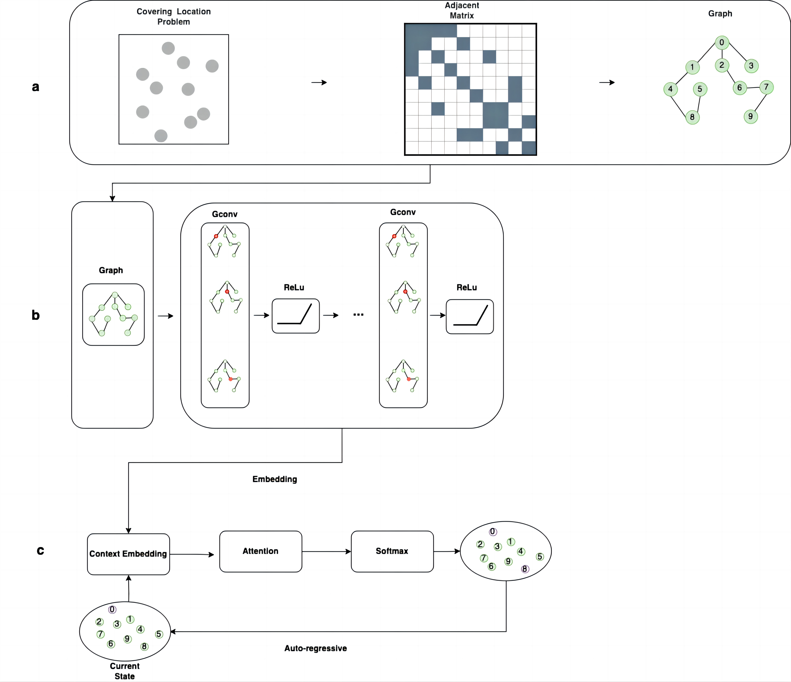

# Dual hybrid frameworks combining graph convolutional network with decoding for covering location problem
This repository contains code for the study "Dual hybrid frameworks combining graph convolutional network with decoding for covering location problem"
We proposed two methods based on graph convolutional networks (GCN) to solve two types of covering location problems: 
LSCP and the MCLP. The first method, GCN-Greedy, is a supervised algorithm that synergized with the Greedy algorithm as decoder. 
It designs a specialized loss function to train the model, tailored to the characteristics of the two covering location problems. 
The second method, reinforcement learning based on GCN with auto-regressive decoder (GCN-AR-RL), represents a reinforcement learning framework that integrates a GCN encoder with an auto-regressive decoder.
The framework of GCN-Greedy:

The framework of GCN-AR-RL:



## Usage
We ran our code using Python 3.8.0, PyTorch 1.12.1 and CUDA 11.7.
### Dependencies
Install all dependencies using pip.
```shell
pip install -f requirements.txt
```
### Quick start
Download and unzip [`data.zip`](https://drive.google.com/file/d/1pmk8NhM2sfqmZ7hiqw0bT1e1NbVWeMhQ/view). Then use this dataset to train the GCN-Greedy for LSCP and MCLP.
```shell
python main.py train  lscp  data/train/lscp/50/ --output models/lscp/50 --epochs 100 --lr 0.001
python main.py train  mclp  data/train/mclp/20/  --output models/mclp/20 --epochs 100 --lr 0.001
```

### Graph dataset generation
Generate graph samples from npz data for LSCP and MCLP problem.
```shell
python ./generate_sample.py lscp <src sample path dir > <dst path dir >
python ./generate_sample.py mclp <src sample path dir > <dst path dir >
```
### Train
Train the model using this framework.
```shell
python main.py train  <problem type>  <train sample path>  --output <model save dir>  
<problem type> : lscp/mclp
```

### Test
Test the trained model using test dataset.
```shell 
python main.py solve  <problem type>  <test sample dir>  --pretrained_weights <model save path>  
```
## Support 
If you are having trouble, please create an issue.